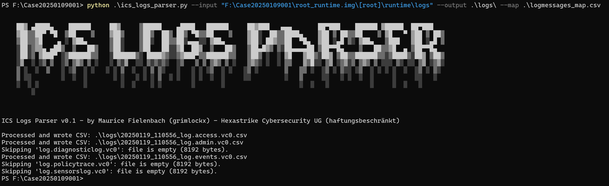
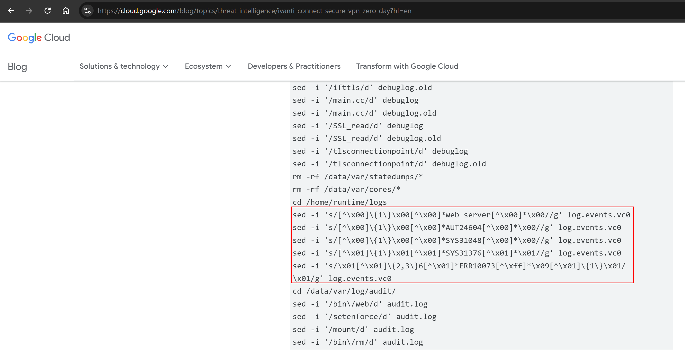
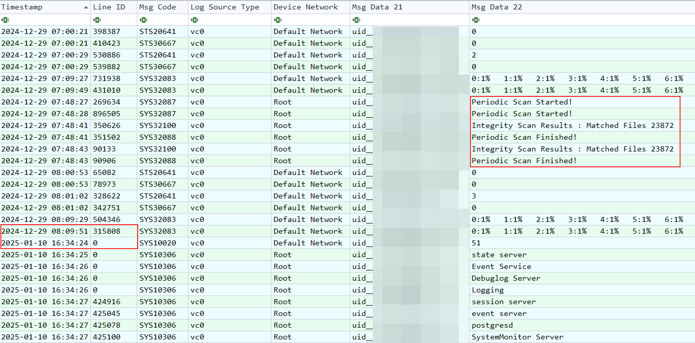
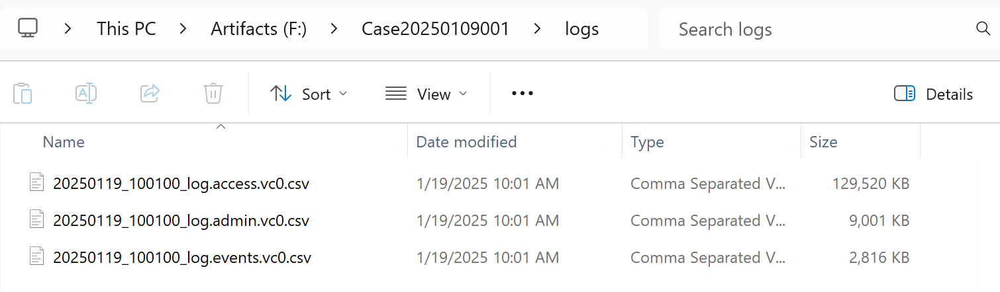
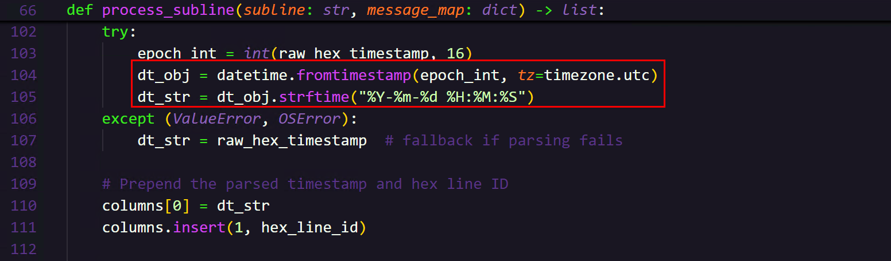

# Ivanti Secure Connect Logs Parser

This repository provides a Python script designed to convert Ivanti Secure Connect .vc0 log files into CSV format for digital forensics and incident response. In particular, the parser:

- Extracts timestamps from Ivanti log files (notably from `.vc0` files).
- Converts these hexadecimal timestamps into human-readable date/time strings.
- Converts the log entries into a readable CSV.
- Maps each log’s message code to a descriptive message type and message text, based on a reference CSV.



The tool was originally developed while investigating CVE-2025-0282 (an unauthenticated RCE vulnerability affecting certain Ivanti appliances). Reports from Mandiant and others indicate that threat actors may remove or alter log entries to hide their activities. By parsing and analyzing these .vc0 files, investigators can more easily spot evidence of compromise, unusual deletions, or other suspicious behavior.



During multiple incident response engagements involving Ivanti Secure Connect, certain appliances were found to exhibit incomplete or tampered logs—some showed no entries at all until exploitation of CVE-2025-0282 was detected and the appliance was rebooted. Additionally, the built-in integrity checks, which typically run every two hours, may be disabled or altered by an attacker. By converting `.vc0` files into a more user-friendly CSV format, this tool helps investigators identify anomalies, such as missing log entries, unexpected authentication attempts, and potential signs of data manipulation.



# Usage

```python
PS F:\Case20250109001> python .\ics_logs_parser.py -h
usage: ics_logs_parser.py [-h] --input INPUT --output OUTPUT --mapfile MAPFILE

Process .vc0 files and convert them to .csv files.

options:
  -h, --help         show this help message and exit
  --input INPUT      Directory containing .vc0 files
  --output OUTPUT    Directory to save .csv files
  --mapfile MAPFILE  CSV file mapping [MessageCode, MessageType, Description]
```
## Example

```PowerShell
python .\ics_logs_parser.py --input "F:\Case20250109001\root_runtime.img\[root]\runtime\logs" --output .\logs\ --map .\logmessages_map.csv
```

- `--input`: Directory containing .vc0 log files extracted from Ivanti Secure Connect.
- `--output`: Directory where the CSVs will be written.
- `--mapfile`: CSV file mapping each message code to a message type and description.



## Message Codes

`logmessages_map.csv` stores the known message codes and their corresponding message types and descriptions. While this list (sourced from publicly available Ivanti documentation and community research) is extensive, it may not include every message code in existence. We encourage users to review or customize the mapping as needed for their environment. See the Resources section for the original references.

## Timestamps

By default, timestamps are converted to UTC. If you need to localize them or format them differently, you can modify the `datetime.fromtimestamp(...)` call in the `process_subline()` function.



# Contact

If you have questions, suggestions, or need assistance, feel free to reach out at info@hexastrike.com.

# Resources

- https://github.com/SeizeCyber/Ivanti-Secure-Connect-Logs-Parser
- https://help.ivanti.com/ps/legacy/PPS/9.1Rx/9.1R9/Pulse-Policy-Secure-Error-Message-Guide.pdf
- https://cloud.google.com/blog/topics/threat-intelligence/ivanti-connect-secure-vpn-zero-day?hl=en
- https://community.opentext.com/cyberres/arcsight/f/discussions/249775/juniper-vpn-logging---found-document-outlining-juniper-event-ids-and-formats

# Acknowledgements

- David Abrgel for the original PowerShell ICS parser concept and especially for his thorough replacements of non-printable characters in his PowerShell script.
- Jeff Hochberg for compiling the message codes.
- Mandiant and others for their public advisories on CVE-2025-0282.
